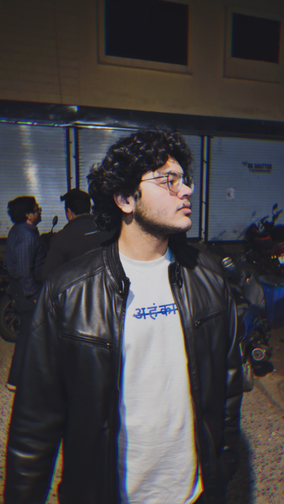
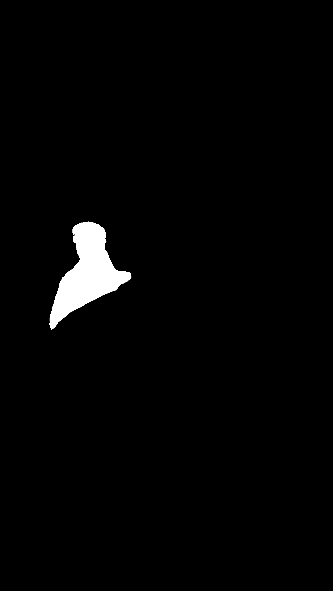
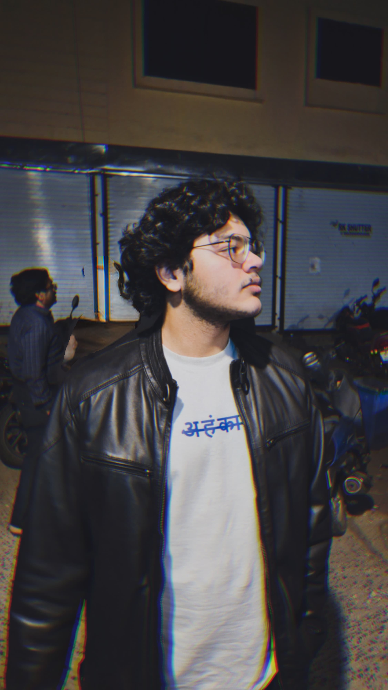
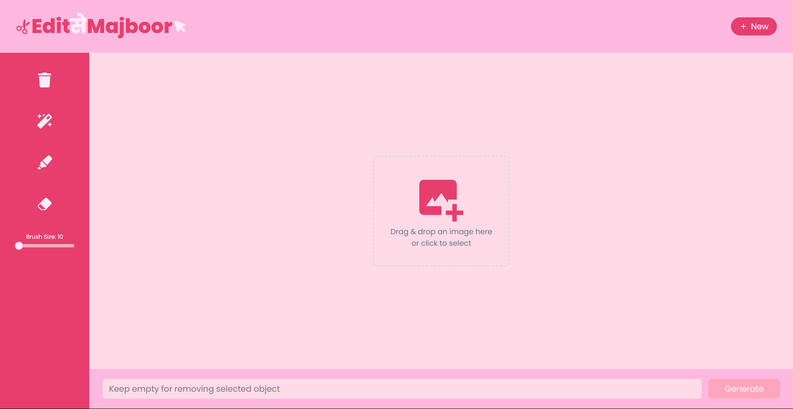
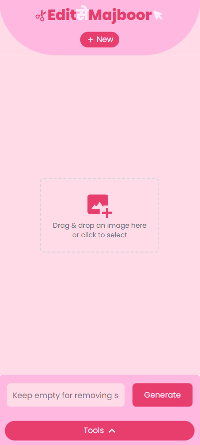

## Edit से Majboor

**Edit से Majboor** is a deep learning–powered web application that enables seamless object removal and content addition within images using Stable Diffusion inpainting. Highlight any region to erase unwanted elements or generate new content directly in the browser.

---

### 🔍 Features

- **Object Removal**: Remove selected objects cleanly using Stable Diffusion inpainting.
- **Content Addition**: Generate and insert new content into highlighted regions.
- **Prompt Box**: Enter custom prompts to guide inpainting results.
- **SAM2 Auto‐Selection**: Click on the image to auto‐generate precise masks powered by SAM2.
- **Interactive Frontend**: Built with Vite, React, and Tailwind CSS for a fast, responsive UI.
- **FastAPI Backend**: Exposes RESTful API endpoints for inpainting and mask generation.
- **Modular Architecture**: Easily extendable with custom models or services.

---

### 🛠️ Tech Stack

| Component        | Technology                  |
| ---------------- | --------------------------- |
| Frontend         | Vite · React · Tailwind CSS |
| Backend          | FastAPI · Uvicorn           |
| Inpainting Model | Stable Diffusion            |
| Language         | JavaScript · Python         |

---

### 📂 Model Weights

Place pretrained model checkpoints in a `weights/` folder at the project root:

- **SAM2 (Segment Anything Model v2)**

  - Download from [facebook/sam2-hiera-large on Hugging Face](https://huggingface.co/facebook/sam2-hiera-large/tree/main)
  - Required files: `sam2-hiera-large.pt` and the corresponding YAML config (e.g. `sam2-hiera-large.yaml`)

- **Stable Diffusion Inpainting**

  - Download version 1464918 from [CivitAI model #15003](https://civitai.com/models/15003?modelVersionId=1464918)
  - Required file: `cyberrealistic_v80Inpainting.safetensors`

Your `weights/` directory should look like:

```plaintext
weights/
├── sam2-hiera-large.pt
├── sam2-hiera-large.yaml
└── cyberrealistic_v80Inpainting.safetensors
```

---

### 🚀 Getting Started

Follow these steps to run the frontend and backend locally.

#### 1. Clone the repository

```bash
# Clone the project
git clone https://github.com/your-username/deepart-image-editor.git
cd deepart-image-editor
```

#### 2. Run the Frontend

```bash
cd frontend
npm install
npm run dev
```

Open your browser at `http://localhost:5173` (or the port reported by Vite).

#### 3. Run the Backend

In the project root:

```bash
# Create and activate a venv (optional but recommended)
python -m venv editEnv
source editEnv/bin/activate   # Linux/macOS
.\editEnv\Scripts\activate  # Windows

# Install dependencies
pip install -r requirements.txt

# Start the FastAPI server with Uvicorn
uvicorn app:app --reload --host 0.0.0.0 --port 8000
```

The API will be available at `http://127.0.0.1:8000`.

---

### 📡 API Endpoints

| Method | Endpoint                | Description                                                             |
| ------ | ----------------------- | ----------------------------------------------------------------------- |
| `POST` | `/upload`               | Upload an image + mask + optional prompt → returns processed image URL  |
| `POST` | `/generate-mask`        | Generate a refined mask based on click coord (x,y) → returns mask image |
| `GET`  | `/processed/{filename}` | Retrieve a processed image by filename                                  |

#### Example: Object Removal or Inpainting

```bash
curl -X POST \
  http://127.0.0.1:8000/upload \
  -F "image=@/path/to/image.jpg" \
  -F "mask=@/path/to/mask.png" \
  -F "prompt=remove the car from the scene"
```

#### Example: Mask Generation

```bash
curl -X POST \
  http://127.0.0.1:8000/generate-mask \
  -F "image=@/path/to/image.jpg" \
  -F "mask=@/path/to/initial_mask.png" \
  -F "x=150" \
  -F "y=200" > refined_mask.png
```

---

### 📦 Example Images

The `example/` folder contains:

- `input.png`: the original input image
- `inputMask.png`: initial mask highlighting the region of interest
- `output.png`: final result after inpainting

<!-- display input, mask, output side by side -->

<p float="left">
  
  
  
</p>

**UI Screenshots** (Desktop & Mobile):

<p float="left">
  
  
</p>

---

### 🤝 Contributing

Contributions welcome!:

1. Fork the repo.
2. Create a feature branch: `git checkout -b feature/YourFeature`
3. Commit changes: `git commit -m "Add YourFeature"`
4. Push: `git push origin feature/YourFeature`
5. Open a PR.

---

### 📄 License

MIT License — see `LICENSE` for details.
